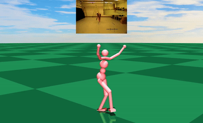

# Residual Force Control (RFC)
 
---
This repo contains the official implementation of our paper:
  
Residual Force Control for Agile Human Behavior Imitation and Extended Motion Synthesis  
Ye Yuan, Kris Kitani  
**NeurIPS 2020**  
[[website](https://www.ye-yuan.com/rfc)] [[paper](https://arxiv.org/pdf/2006.07364.pdf)] [[video](https://youtu.be/XuzH1u78o1Y)]

# Installation 
### Dataset and Pretrained Models
* The CMU mocap data we use is already included in the [data/cmu_mocap](data/cmu_mocap) folder. The pretrained models are in [results/motion_im](results/motion_im) where each subfolder (e.g., [0506](results/motion_im/0506)) corresponds to a training config file (e.g., [0506.yml](motion_imitation/cfg/0506.yml)) in [motion_imitation/cfg](motion_imitation/cfg).
* We have provided the following configs (label): 
0506 (ballet1), 0507 (ballet2), 0513 (ballet3), 8801 (backflip), 9002 (cartwheel), 9005 (jump
kick), 9008 (side flip), 9011 (handspring).
### Environment
* **Tested OS:** MacOS, Linux
* Python >= 3.6
### How to install
1. Install the dependencies:
    ```
    pip install -r requirements.txt
    ```
2. Install MuJoCo following the steps [here](https://github.com/openai/mujoco-py#install-mujoco). Note that [mujoco-py](https://github.com/openai/mujoco-py) (MuJoCo's python binding) is already installed in step 1. This step is to install the actual MuJoCo library.  
   **Note: [MuJoCo](https://mujoco.org/) is now free thanks to DeepMind!** 🎉🎉🎉
3. Set the following environment variable to improve multi-threaded sampling performance:    
    ```
    export OMP_NUM_THREADS=1
    ```

# Quick Demo
### Visualize Pretrained Policy
```
python motion_imitation/vis_im.py --cfg 0506 --iter 1000
```
Here [0506](motion_imitation/cfg/0506.yml) corresponds to the config [motion_imitation/cfg/0506.yml](motion_imitation/cfg/0506.yml) which uses the motion_clip of subject 05 and trial 06 from the [CMU mocap database](http://mocap.cs.cmu.edu/). Check out [motion_imitation/cfg](motion_imitation/cfg) for other configs.

**Keyboard shortcuts** for the GUI:  
| Key           | Functionality          | Key           | Functionality          |
| ------------- | ---------------------- | ------------- | ---------------------- |
| space         | pause/resume animation | w/e           | go to first/last frame |
| left/right    | previous/next frame    | d/f           | slow down/speed up     |
| g             | toggle loop            | s             | toggle reverse         |

# Training
### Prepare training data
**Note**: for motion clips used in the paper, the data has already been processed.

To train policies with other motion clips from the [CMU mocap database](http://mocap.cs.cmu.edu/), you will need to first download the `.amc` mocap file and place it inside [data/cmu_mocap/amc](data/cmu_mocap/amc), and run the following script:
```
python motion_imitation/data_process/convert_cmu_mocap.py --amc_id 05_06 --out_id 05_06_test --render
```
Here we take `05_06.amc` as an example and this command will show a GUI that visualizes the motion clip. The GUI has a few keyboard shortcuts that allow you to adjust the clip and save the training pickle file (`05_06_test.p`) inside [data/cmu_mocap/motion](data/cmu_mocap/motion):
| Key           | Functionality                    | Key           | Functionality           |
| ------------- | -------------------------------- | ------------- | ----------------------- |
| space         | pause/resume animation           | w/e           | go to first/last frame  |
| left/right    | previous/next frame              | d/f           | slow down/speed up      |
| up/down       | move humanoid up/down            | z/x           | set start/end of motion |
| c             | cut motion with selected range   | r             | save motion as pickle   |

If you don't need to adjust the clip, you can just run the script without `--render`, so the motion pickle is saved without GUI.


### Train RFC policy
You can create your own config file using [0506.yml](motion_imitation/cfg/0506.yml) as a template. Be sure to set [motion_id](motion_imitation/cfg/0506.yml#L2) to the motion you have processed. To train an RFC policy, just run:
```
python motion_imitation/motion_im.py --cfg 0506 --num_threads <max_num_CPU_threads_you_have>
```
This will save models and logs into [results/motion_im/0506](results/motion_im/0506).

### Setup dev environment
Install Customized DFlex, this is the main backend package of differentiable physics simulator
```
cd dflex
pip install -e .
```

Install Customized pytorch_kinematics, this is a differentiable robotics kinematics module.
```
cd pytorch_kinematics
pip install -e .
```
